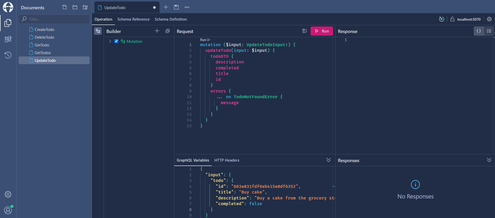

# GraphQl .NET Server POC

This project is a POC of a .NET GraphQL Server written in C#. 

The implementations is done with [Hot Chocolate](https://chillicream.com/docs/hotchocolate/) library.
The server expose different methods to query and mutate data in a Mongo Database containing a Todo list collection.

## Getting Started
To build run the project you need to have a MongoDb istance running on your computer. 
In order to do that if you have installed Docker on your machine you can use the docker-compose in this repository:
1. Clone the repo
2. Run MongoDb with Docker
   ```sh
   cd graphql-dotnet-server
   docker compose up -d
   ```

Then you can run the project:
1. Open the solution with Visual Studio or Visual Studio Code and run the project
2. On [http://localhost:5070/graphql/](http://localhost:5070/graphql/) you should see a page like this:

